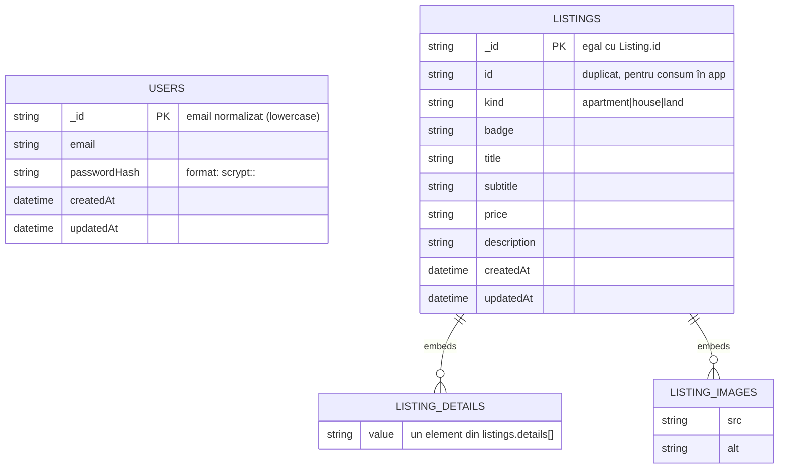

# MongoDB ERD (Schema – din cod)

Diagrama de mai jos descrie colecțiile MongoDB folosite efectiv în aplicație (conform `src/lib/usersDb.ts` și `src/lib/listingsDb.ts`).

## Observații

- **Nu există relații între `users` și `listings`** în codul actual (nicio referință / foreign key).
- Formularele `contact` și `vizionare` trimit email (SMTP) și **nu salvează** în MongoDB.

